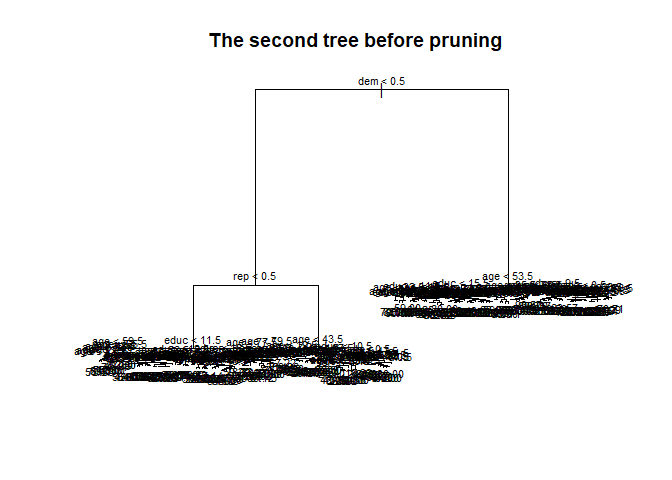
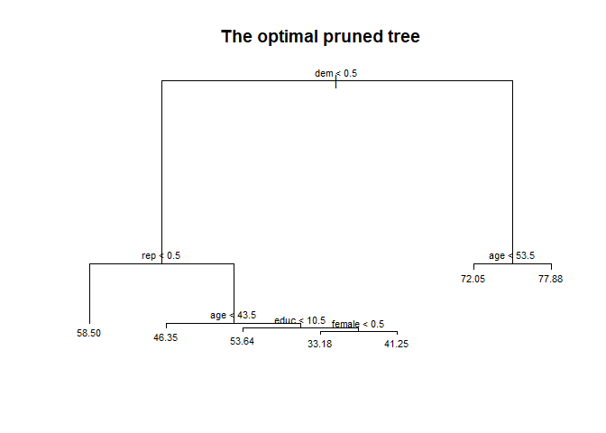
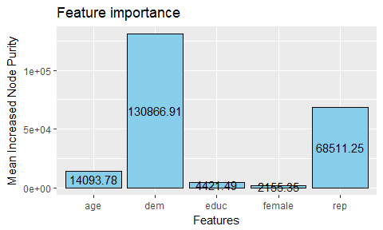

PS 6
================
Kanyao Han

``` r
library(tidyverse)
library(modelr)
library(tree)
library(randomForest)

set.seed(2)
```

``` r
# read the data
biden <- read_csv("biden.csv")

# split the data
biden_split <- resample_partition(biden, c(test = 0.3, train = 0.7))

# MSE function
mse <- function(model, data) {
  x <- modelr:::residuals(model, data)
  mean(x ^ 2, na.rm = TRUE)
}


features <- "biden ~ female + age + educ + dem + rep"
```

Part a)
-------

``` r
# train the first tree


biden_result1 <- tree(formula(features), data = biden_split$train,
                      method = "recursive.partition")
```

``` r
# plot
plot(biden_result1)
text(biden_result1) 
title(main = "The first tree with default control")
```


In the default setting in R, only the features "dem" and "rep" have effects in the model. The predicted democrats' feeling thermometer is 74.31, republicans' are 41.35 and those who are neither dem nor rep have the feeling thermometer of 58.5.

``` r
# Calculate the MSE
mse1 = mse(biden_result1,biden_split$test)
print("The test mse of the first tree:")
```

    ## [1] "The test mse of the first tree:"

``` r
print(mse1)
```

    ## [1] 390.1726

Part b). The second tree and pruning
------------------------------------

**In this part, I first fit a tree with out pruning and plot it. And then I choose an optimal pruned tree and plot it.**

``` r
# tree with control
biden_result2 <- tree(formula(features), data = biden_split$train,
                      control = tree.control(nobs = nrow(biden_split$train),
                                             mindev = 0))

mse2 <- mse(biden_result2, biden_split$test)


plot(biden_result2)
text(biden_result2, cex = 0.3) 
title(main = "The second tree before pruning")
```



``` r
# pruned trees
pruned_trees <- map(2:30, prune.tree, tree = biden_result2, k = NULL)
mses <- map_dbl(pruned_trees, mse, data = biden_split$test)

opt_tree <- pruned_trees[[which.min(mses)]]
opt_mse <- mse(opt_tree, biden_split$test)

data.frame(num_nodes = 2:30, mses = mses) %>%
  ggplot(aes(x = num_nodes, y = mses)) +
  geom_line() + 
  scale_x_continuous(breaks =  c(5, 10, 15, 20, 25, 30)) +
  labs(title = "MSES with different number of nodes when we prune the tree",
       x = "Number of Nodes",
       y = "Test MSE")
```


This graph shows that both too much and too less nodes will cause high test mse.

``` r
plot(opt_tree)
text(opt_tree, cex = 0.7)
title(main = "The optimal pruned tree")
```



The optimal pruning method produces a medium tree, all features (dem, rep, age, educ and female) make effects in the model. Dem, rep and age have the highest importance. Besides, those who are neither rep nor dem would not heavily influenced by their demographic features, but both dem and rep would be influenced by some or all demographic features. The largest predicted feeling thermometer is 77.88 from democrats older than 53.5 and the smallest feeling thermometer is 33.18 from poor-educated female republicans older than 43.5.

``` r
print("The test mse of the second tree with out pruning:")
```

    ## [1] "The test mse of the second tree with out pruning:"

``` r
print(mse2)
```

    ## [1] 483.2683

``` r
print("The test mse of optimal pruned tree:")
```

    ## [1] "The test mse of optimal pruned tree:"

``` r
print(opt_mse)
```

    ## [1] 385.1833

There is no doubt that the test mse of pruned tree is much smaller than that of the original tree.

part c). Bagging
----------------

``` r
# Bagging is simply a special case of a random forest with m = p. 
# So we can use random forest function.
bag_tree <- randomForest(formula(features), data = biden_split$train, 
                         mtry = 5, ntree = 500, importance=TRUE)

mse_bag <-  mse(bag_tree, biden_split$test)
print("The test mse of bagging tree:")
```

    ## [1] "The test mse of bagging tree:"

``` r
print(mse_bag)
```

    ## [1] 467.2344

``` r
# bagging importance
bag_importance <- as.data.frame(importance(bag_tree)) %>%
  add_rownames("features") %>%
  mutate(IncNodePurity = round(IncNodePurity, 2))


ggplot(bag_importance, aes(features, IncNodePurity)) +
  geom_col(fill = 'sky blue', color = "black") +
  geom_text(aes(label = IncNodePurity, y = (IncNodePurity / 2))) %>%
  labs(title = "Feature importance",
       x = "Features",
       y = "Node Purity")
```



Age is the most important feature in bagging model and female is the least important. dem, educ and rep have moderate importance. However, the test mse of this model is not good, much worse than the pruned tree and very similar to the second tree before pruning.

Part d). Random forest
----------------------

``` r
#train tree
biden_rf1 <- randomForest(biden ~ ., data = biden_split$train, mtry =1,ntree = 500)
biden_rf2 <- randomForest(biden ~ ., data = biden_split$train, mtry =2,ntree = 500)
biden_rf3 <- randomForest(biden ~ ., data = biden_split$train, mtry =3,ntree = 500)
```

``` r
#calculate MSE
mse_rf1 = mse(biden_rf1, biden_split$test)
mse_rf2 = mse(biden_rf2, biden_split$test)
mse_rf3 = mse(biden_rf3, biden_split$test)

print("the test mse with 1, 2 and 3 features are respectively:")
```

    ## [1] "the test mse with 1, 2 and 3 features are respectively:"

``` r
print(c(mse_rf1, mse_rf2, mse_rf3))
```

    ## [1] 388.2278 394.2489 426.1068

``` r
importance1 <-  as.data.frame(importance(biden_rf1)) %>%
  add_rownames("features")

importance2 <-  as.data.frame(importance(biden_rf2)) %>%
  add_rownames("features")

importance3 <-  as.data.frame(importance(biden_rf3)) %>%
  add_rownames("features")


importances <- bind_rows("m = 1" = importance1, 
                         "m = 2" = importance2, 
                         "m = 3" = importance3, .id = "m") %>%
  mutate(IncNodePurity = round(IncNodePurity, 2))

ggplot(importances, aes(features, IncNodePurity)) +
  geom_col(fill = 'sky blue', color = "black") +
  geom_text(aes(label = IncNodePurity, y = (IncNodePurity / 2)),
            size = 2) +
  facet_wrap(~ m) +
  labs(title = "Feature importance",
       x = "Features",
       y = "Node Purity")
```

 The first two mses are very similar (the former is slightly better than the latter) and the final one is obviously larger than them. This is because we only have 5 features so that the optimal parameter for random forest should be less than 2. If we choose too many features, such as m = 3, some features, which might cause overfitting problem, are still frequently selected and serve as the important features. In other words, other good features' importances are suppressed.

The graph of feature importance provide the evidence of this reasoning. When m = 1 or 2, dem and rep are very important, and age, educ and female are unimportant. However, when m = 3, the results of importance are very similar to those in the bagging model: the importance of age is much larger than dem and rep, and educ is also moderately important. These results demonstrate age (and sometimes probabily educ) is not a good predictor but has enough importance in a single tree. In this case, when we set a small m, a large percent of trees in random forest will not be based on important but bad features and thus has a better prediction.
