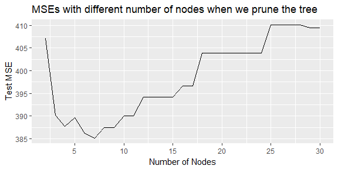

PS 6
================
Kanyao Han

Part a
------

``` r
library(tidyverse)
library(forcats)
library(broom)
library(modelr)
library(tree)
library(randomForest)
library(stringr)
library(grid)
library(gridExtra)
library(ggdendro)

set.seed(2)
```

``` r
# read the data
biden <- read_csv("biden.csv")
```

``` r
# split the data
biden_split <- resample_partition(biden, c(test = 0.3, train = 0.7))
```

``` r
# train the first tree with the 
biden_result1 <- tree(biden ~ female + age + educ + 
                        dem + rep, data = biden_split$train,
                      method = "recursive.partition")
```

``` r
# plot
result_tree <- dendro_data(biden_result1)

ggplot(segment(result_tree)) +
  geom_segment(aes(x = x, y = y, xend = xend, yend = yend)) +
  geom_text(data = label(result_tree), 
            aes(x = x, y = y, label = label), 
            vjust = -0.5, size = 4, color = 'blue') +
  geom_text(data = leaf_label(result_tree), 
            aes(x = x, y = y, label = label), 
            vjust = 1, size = 4, color = 'red') +
  theme_dendro()
```


``` r
# Calculate the MSE

mse <- function(model, data) {
  x <- modelr:::residuals(model, data)
  mean(x ^ 2, na.rm = TRUE)
}

mse1 = mse(biden_result1,biden_split$test)
print("The mse of the first tree:")
```

    ## [1] "The mse of the first tree:"

``` r
mse1
```

    ## [1] 390.1726

``` r
# tree with control
biden_tree_2 <- tree(biden ~ female + age + educ + 
                        dem + rep, data = biden_split$train,
     control = tree.control(nobs = nrow(biden_split$train),
                            mindev = 0))

mse2 <- mse(biden_tree_2, biden_split$test)


# pruned trees
pruned_trees <- map(2:30, prune.tree, tree = biden_tree_2, k = NULL)
mses <- map_dbl(pruned_trees, mse, data = biden_split$test)

opt_tree <- pruned_trees[[which.min(mses)]]
opt_mse <- mse(opt_tree, biden_split$test)


tibble(num_nodes = 2:30, mses = mses) %>%
  ggplot(aes(x = num_nodes, y = mses)) +
  geom_line() + 
  scale_x_continuous(breaks =  c(5, 10, 15, 20, 25, 30))
```



``` r
result2_tree <- dendro_data(opt_tree)

ggplot(segment(result2_tree)) +
  geom_segment(aes(x = x, y = y, xend = xend, yend = yend)) +
  geom_text(data = label(result2_tree), 
            aes(x = x, y = y, label = label), 
            vjust = -0.5, size = 4, color = 'blue') +
  geom_text(data = leaf_label(result2_tree), 
            aes(x = x, y = y, label = label), 
            vjust = 1, size = 4, color = 'red') +
  theme_dendro()
```


``` r
print("The mse of the second tree with out pruning:")
```

    ## [1] "The mse of the second tree with out pruning:"

``` r
mse2
```

    ## [1] 483.2683

``` r
print("The mse of optimal pruned tree:")
```

    ## [1] "The mse of optimal pruned tree:"

``` r
opt_mse
```

    ## [1] 385.1833

``` r
bag_tree <- randomForest(biden ~ ., data = biden_split$train, mtry = 5, ntree = 500, importance=TRUE)
mse_bag <-  mse(bag_tree, biden_split$test)
print("The mse of bagging tree:")
```

    ## [1] "The mse of bagging tree:"

``` r
mse_bag
```

    ## [1] 467.2344

``` r
# bagging importance
bag_importance <- as.data.frame(importance(bag_tree)) %>%
  add_rownames("features")

ggplot(bag_importance, aes(features, IncNodePurity)) +
  geom_col(fill = 'sky blue', color = "black") +
  geom_text(aes(label = IncNodePurity, y = (IncNodePurity / 2)))
```


``` r
bag_importance
```

    ## # A tibble: 5 x 3
    ##   features `%IncMSE` IncNodePurity
    ##      <chr>     <dbl>         <dbl>
    ## 1   female -6.168788      28550.94
    ## 2      age  3.656304     234230.11
    ## 3     educ  1.176706      99444.25
    ## 4      dem 60.724308     133644.37
    ## 5      rep 31.652675      65438.56

``` r
biden_rf1 <- randomForest(biden ~ ., data = biden_split$train, mtry =1,ntree = 500)
biden_rf2 <- randomForest(biden ~ ., data = biden_split$train, mtry =2,ntree = 500)
biden_rf3 <- randomForest(biden ~ ., data = biden_split$train, mtry =3,ntree = 500)
```

``` r
mse_rf1 = mse(biden_rf1, biden_split$test)
mse_rf2 = mse(biden_rf2, biden_split$test)
mse_rf3 = mse(biden_rf3, biden_split$test)
```

``` r
mse_rf1
```

    ## [1] 388.2278

``` r
mse_rf2
```

    ## [1] 394.2489

``` r
mse_rf3
```

    ## [1] 426.1068

``` r
importance1 <-  as.data.frame(importance(biden_rf1)) %>%
  add_rownames("features")
importance2 <-  as.data.frame(importance(biden_rf2)) %>%
  add_rownames("features")
importance3 <-  as.data.frame(importance(biden_rf3)) %>%
  add_rownames("features")
importances <- bind_rows("m = 1" = importance1, "m = 2" = importance2, "m = 3" = importance3, .id = "m")

ggplot(importances, aes(features, IncNodePurity)) +
  geom_col(fill = 'sky blue', color = "black") +
  facet_wrap(~ m, scales = "free_x")
```


