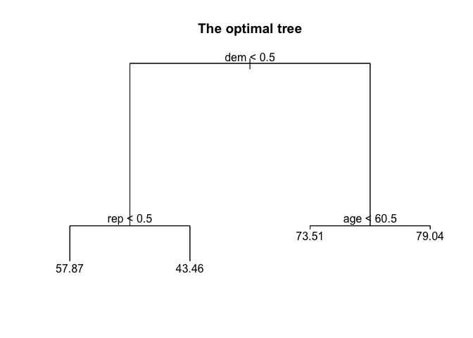
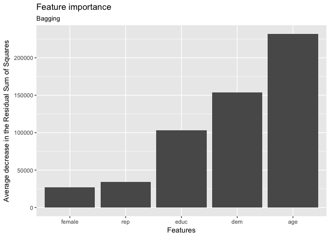
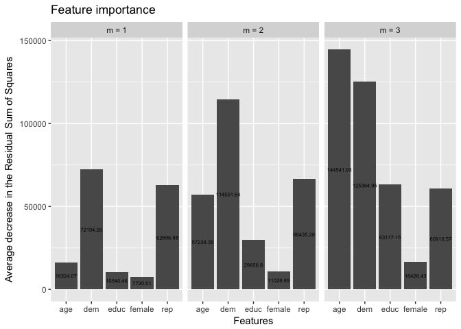

PS6\_Liqiang\_Yu
================
Liqiang Yu
2/25/2018

MACS 30100, Dr. Evans
Due Monday, Feb. 26 at 11:30am
Liqiang Yu

### (a)

Split the data into a training set (70%) and a test set (30%). Be sure to set your seed prior to this part of your code to guarantee reproducibility of results. Use recursive binary splitting to fit a decision tree to the training data, with biden as the response variable and the other variables as predictors. Plot the tree and interpret the results. What is the test MSE?

``` r
library(tidyverse)
```

    ## ── Attaching packages ─────────────────────────────────────────────────── tidyverse 1.2.1 ──

    ## ✔ ggplot2 2.2.1     ✔ purrr   0.2.4
    ## ✔ tibble  1.3.4     ✔ dplyr   0.7.4
    ## ✔ tidyr   0.7.2     ✔ stringr 1.2.0
    ## ✔ readr   1.1.1     ✔ forcats 0.2.0

    ## ── Conflicts ────────────────────────────────────────────────────── tidyverse_conflicts() ──
    ## ✖ dplyr::filter() masks stats::filter()
    ## ✖ dplyr::lag()    masks stats::lag()

``` r
library(modelr)
library(tree)
library(randomForest)
```

    ## randomForest 4.6-12

    ## Type rfNews() to see new features/changes/bug fixes.

    ## 
    ## Attaching package: 'randomForest'

    ## The following object is masked from 'package:dplyr':
    ## 
    ##     combine

    ## The following object is masked from 'package:ggplot2':
    ## 
    ##     margin

``` r
#the random state could affect the result significantly
set.seed(1)

biden <- read.csv('biden.csv')

train_test <- resample_partition(biden, c(test = 0.3, train = 0.7))

bid_tree1 <- tree(biden ~ female + age + educ + dem + rep, data = train_test$train,method = 'recursive.partition')
predictions1 <- predict(bid_tree1, train_test$test)

mse <- function(model, data){
  new_data <- data%>%
  add_residuals(model)
  return(mean(new_data$resid ^ 2))
}
bid_tree1_mse = mse(bid_tree1,train_test$test)
bid_tree1_mse
```

    ## [1] 390.366

``` r
plot(bid_tree1)
text(bid_tree1)
title(main = 'Recursive Binary Splitting Tree For Biden Data')
```


There are three leaves in the tree. From left to the right, we expect a person who is neither a Democrat nor a Republican to give a thermometer value of 57.6. While a Republican is predicted to give a score of 43.23 and a Democrat is supposed to give a 74.51 on thermometer feeling index. The test MSE is 390.366.

### (b)

Leave the control options for tree() at their default values. Now fit another tree to the training data with the following control options: tree(control = tree.control(nobs = \# number of rows in the training set, mindev = 0)) Use cross-validation to determine the optimal level of tree complexity, plot the optimal tree, and interpret the results. Does pruning the tree improve the test MSE?

``` r
bid_tree2 <- tree(biden ~ female + age + educ + dem + rep, data = train_test$train,
                      control = tree.control(nobs = nrow(train_test$train),
                                             mindev = 0))
mse2 <- mse(bid_tree2, train_test$test)
pruned_trees <- map(2:30, prune.tree, tree = bid_tree2, k = NULL)
mses <- map_dbl(pruned_trees, mse, data = train_test$test)

data.frame(num_nodes = 2:30, mses = mses) %>%
  ggplot(aes(x = num_nodes, y = mses)) +
  geom_line() + 
  scale_x_continuous(breaks =  c(5, 10, 15, 20, 25, 30)) +
  labs(title = "MSE And Number of Nodes Relation",
       x = "Number of Nodes",
       y = "Test MSE")
```


``` r
opt_tree <- pruned_trees[[which.min(mses)]]
opt_mse <- mse(opt_tree, train_test$test)
plot(opt_tree)
text(opt_tree)
title(main = "The optimal tree")
```



``` r
mse2
```

    ## [1] 461.8003

``` r
opt_mse
```

    ## [1] 387.2976

In this pruned tree, there are four leaves (the result depends on the train-test split). From left to the right, we expect a person who is neither a Democrat nor a Republican to give a thermometer value of 57.87. While a Republican is predicted to give a score of 43.46. A Democrat who is under 60.5 years old is supposed to give a 73.51 on the thermometer feeling index and who is above 60.5 years old is predicted to give a score of 79.04. The pruning improved the test MSE from 461.80 to 387.30.

### (c)

Use the bagging approach to estimate a tree to create a model for predicting biden. What test MSE do you obtain? Obtain variable importance measures and interpret the results.

``` r
biden_bag <- randomForest(biden ~ ., data = train_test$train,
                             mtry = 5, ntree = 500)
data_frame(var = rownames(importance(biden_bag)),
           MeanDecreaseRSS = importance(biden_bag)[,1]) %>%
  mutate(var = fct_reorder(var, MeanDecreaseRSS, fun = median)) %>%
  ggplot(aes(var, MeanDecreaseRSS)) +
  geom_col() +
  labs(title = "Feature importance",
       subtitle = "Bagging",
       x = "Features",
       y = "Average decrease in the Residual Sum of Squares")
```



``` r
mse(biden_bag, train_test$test)
```

    ## [1] 441.2945

Using bagging, the test MSE is 443.15. From the graph above, the most important variable is 'age' and the least important variable is 'female'. The result is worse than the previous pruned tree.

### (d)

Use the random forest approach to estimate a tree to create a model for predicting biden. Do this for m = 1, m = 2, and m = 3 (the number of variables). What test MSE do you obtain in each case? Obtain variable importance measures and interpret the results. Describe the effect of m, the number of variables considered at each split, on the error rate obtained.

``` r
biden_rf1 <- randomForest(biden ~ ., data = train_test$train, mtry =1,ntree = 500)
biden_rf2 <- randomForest(biden ~ ., data = train_test$train, mtry =2,ntree = 500)
biden_rf3 <- randomForest(biden ~ ., data = train_test$train, mtry =3,ntree = 500)
mse_rf1 = mse(biden_rf1, train_test$test)
mse_rf2 = mse(biden_rf2, train_test$test)
mse_rf3 = mse(biden_rf3, train_test$test)
```

``` r
importance1 <-  as.data.frame(importance(biden_rf1)) %>%
  add_rownames("features")
```

    ## Warning: Deprecated, use tibble::rownames_to_column() instead.

``` r
importance2 <-  as.data.frame(importance(biden_rf2)) %>%
  add_rownames("features")
```

    ## Warning: Deprecated, use tibble::rownames_to_column() instead.

``` r
importance3 <-  as.data.frame(importance(biden_rf3)) %>%
  add_rownames("features")
```

    ## Warning: Deprecated, use tibble::rownames_to_column() instead.

``` r
importances <- bind_rows("m = 1" = importance1, 
                         "m = 2" = importance2, 
                         "m = 3" = importance3, .id = "m") %>%
  mutate(IncNodePurity = round(IncNodePurity, 2))

ggplot(importances, aes(features, IncNodePurity)) +
  geom_col() +
  geom_text(aes(label = IncNodePurity, y = (IncNodePurity / 2)),
            size = 2) +
  facet_wrap(~ m) +
  labs(title = "Feature importance",
       x = "Features",
       y = "Average decrease in the Residual Sum of Squares")
```



``` r
mse_rf1
```

    ## [1] 390.6431

``` r
mse_rf2
```

    ## [1] 387.0182

``` r
mse_rf3
```

    ## [1] 403.236

The test MSE for each are given above for m=1, m=2, and m=3 respectively. For m=1, the variable 'dem' and 'rep' are important, while others are not important. For m=2, except that 'dem' and 'rep' remain important, 'age' also became important in this model. For m=3, feature importance changed a lot. 'age' and 'dem' are important while others are not.

As we can see from the result, when m (the number of variables considered at each split) is in a reasonable range (not overfitting, such as m=1 or m=2), increasing it will only increase the error rate obtained and it will not change the ranking of feature importance. However, when m is large and causes overfitting, the error rate and its ranking could change significantly. In the particular result, we conclude that 'age' and 'educ' are not good predictors, so a random forest model could exclude these variables to obtain a better result.
